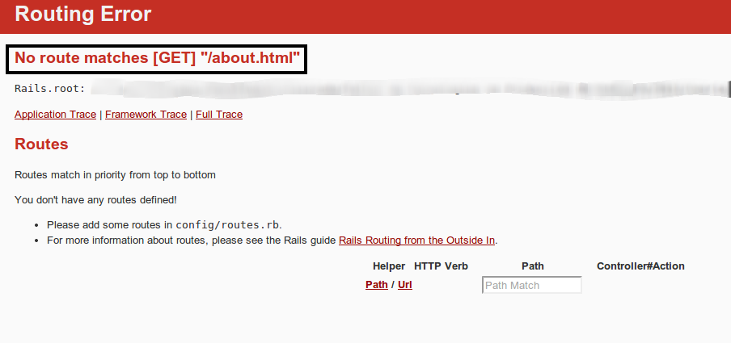

!SLIDE bullets transition=uncover 
# Páginas estáticas y ruteo
* Una aplicación rails puede servir páginas estáticas como cualquier web server
* Estas páginas no contienen código ruby
  * Esto hace que se sirvan de forma más rápida y usando menos recursos
* Empezar por crear páginas estáticas nos ayudará a entender el ruteo en rails

!SLIDE smbullets transition=uncover small
# Agregamos la home page
* Nos aseguramos tener iniciado el server rails: `bundle exec rails s`
* Ingresamos a [http://localhost:3000/](http://localhost:3000/)
  * Veremos la página de información por defecto de rails

## Creemos el archivo `public/index.html`

	@@@ html
	<h1> Hello World </h1>

* Actualizamos la página y...
* rails observará los cambios de la carpeta `public/`
* Si no se especifica ningun archivo en la URL, se asume **index.html**
	* La razón de este hecho data de 1993 con la creación del primer web server

!SLIDE bullets transition=uncover smaller
# Error de ruteo
* Qué sucede si accedemos a [http://localhost:3000/about.html](http://localhost:3000/about.html)

!SLIDE bullets transition=uncover
# Agregamos `public/about.html`

	@@@ html
	<h1> About </h1>

*Ahora todo debería funcionar bien*

!SLIDE smbullets transition=uncover small
# Introduciendo el ruteo
* El principio de *convention over configuration* govierna el ruteo en rails
* Si un navegador solicita **index.html** entonces Rails servirá la página desde
  el directorio `public/` por defecto
	* No se necesita configuración para ello
* ¿Si queremos cambiar este comportamiento?
	* Haremos que la home page sea ahora el about
	* Debemos **eliminar** public/index.html: `rm public/index.html`

## Editamos `config/routes.rb`

	@@@ ruby
	LearnRails::Application.routes.draw do
		root to: redirect('/about.html')
	end
!SLIDE smbullets transition=uncover 
# Una reflexión
* El caso anterior es un ejemplo de la *magia de rails* 
* Algunos desarrolladores consideran que *convention over configuration* es
  **magia negra**
* No es obvio el por qué las páginas se sirven de `public/`
* Si se desconoce esta convención, podemos rompernos la cabeza buscando donde se
  mapea que http://localhost:3000 sirva `public/index.html`
	* El código que implementa esto, está enterrado profundamente en el corazón de
	  rails
